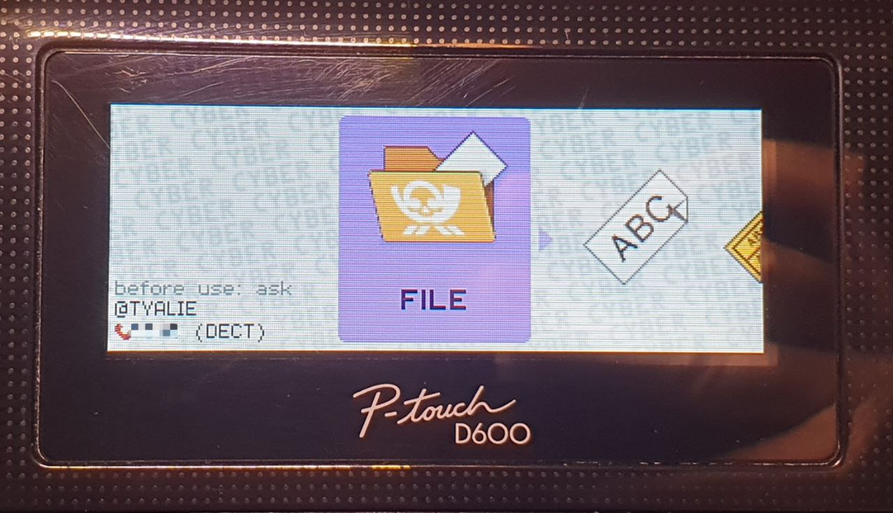

# Brother PD3 Tools

This is a set of utilities to extract, verify and repack (some of) Brothers
proprietary `.PD3` file formats. These are used for example to transfer new fonts or
new UI elements (where supported) to their P-Touch devices which can be attached to a
PC.

> [!NOTE]
> This is very much a WIP. Custom theming works, but I'm **not** interested rn
> looking into their TEMPLATE or FONT transfer files in more depth. Although I'm
> happy to accept PRs.




## Capabilities

Currently, the capabilities of this toolset only extend so far, as the file formats
have been reverse engineered. So only custom themes are possible rn.

- ✅ processing COLOR PD3 files (used for theming UI)
  - ✅ verify
  - ✅ extract contained BMP images
  - ✅ repackage PD3 with custom images
- ❌ parse FONT PD3 files
- ❌ parse template PD3

Any help in opening the later two formats are welcome ^^

## The file format

Brother uses `.PD3` (often in zip container with `.PDZ` extension) files in order to
transfer templates, fonts, … to their family of label printers. Most commonly it is
used for the former. Using P-Touch Editor one can create templates on a PC and
transfer them to network, USB or serial attached P-Touch label printers (this is
currently reserved for P-Touch Editor <6.0). 

One of the many intermediate formats in this process are `.PDZ` zip containers. One
can even export them in the Brother Transfer Manager and deploy them afterwards using
e.g. the Brother Transfer Express utility.

Due to something, which let Brother in 2018 to upload a "Font Update Tool" for their
former up-to-date assortment of supported and PC-attachable Brother label printers,
we got a hint of what we can also do with this `.PD3` file format. In this case
the updater contained a "FONT" file and for the PT-D600 additionally a "COLOR" file.
I initially looked at it in hopes of updating the build-in emojis, but I found that I
can upload custom themes on my PT-D600 using the COLOR PD3.

> [!NOTE]
> This update tool can still be found on the "Downloads" page for a few devices.
> Interestingly only on the US version of the page (e.g. [for the PT-D600][1]). So
> far I've found a font update tool (including the `.PD3`) for these models: PT-D450,
> PT-D600, PT-D800W and PT-E800W

### The COLOR PD3

A COLOR `.PD3` file contains besides the standard `.PD3` header a reference table and
a list of Windows Bitmap v3 files stitched end-to-end.

The order of elements in the table seem to be very relevant as the COLOR `.PD3` does
not contain any further information about an entry except the address of the image
associated with it. As such this tool enforces a strict naming scheme which mentions
the table index and image dimensions. In reality some table entries can even be left
blank.

The header itself does not seem to carry anything relevant except that the string
"FP-COLOR" occurs at file address 0x20.

## How to use it

First off, install the dependencies from the `requirements.txt` using pip.
```
python3 -m pip install -r ./requirements.txt
```

It is recommended to do this in a virtual environment, as we require a recent Pillow
version.

### Getting and repacking PD3s

Generally the printer update tools (e.g. P-Touch Transfer Express) do not accept
`.PD3` natively (not verified). Instead, they require a `.PDZ` container. Luckily
for us this is very easy to do. Decompression also happens on the PC side, so we
don't even need to care if your zip has a special format.

Example
```
❯ unzip -l PT-D600_FP-FONT_ALL_USA_V0101.PDZ
Archive:  PT-D600_FP-FONT_ALL_USA_V0101.PDZ
  Length      Date    Time    Name
---------  ---------- -----   ----
  5243008  2016-04-24 10:27   PT-D600_FP-FONT_ALL_USA_V0101.PD3
  8126592  2016-05-02 09:41   PT-D600_FP-COLOR_ALL_USA_V0101.PD3
---------                     -------
 13369600                     2 files
```

To replace the `PT-D600_FP-COLOR_ALL_USA_V0101.PD3` just use `zip` with 

```
# this command replaces the COLOR PD3 inside the PDZ archive, with the
# COLOR PD3 outside of the archive. The naming must match for this to work
zip PT-D600_FP-FONT_ALL_USA_V0101.PDZ PT-D600_FP-COLOR_ALL_USA_V0101.PD3
```

> [!NOTE]
> I've no verified (yet) on whether the naming scheme is relevant or not. Please open
> an issue if you've got more information.

### The `modify_color.py` script

> [!WARNING]
> Please read this section carefully. The scripts are rn not very descriptive
> if something goes wrong.

In order to extract images from and repackage them into a COLOR PD3 files on can use
the [`modify_color.py`](./modify_color.py) file.

CLI description
```
$ ./modify_color.py --help
usage: modify_color.py [-h] -i INPUT {list,extract,combine,verify} ...

Tool to manipulate, repackage, verify or analyze a COLOR PD3 file used by Brother label printers

positional arguments:
  {list,extract,combine,verify}
    list                List all COLOR table entries
    extract             Extract a COLOR PD3 file including header and images into a folder
    combine             Combine a conforming folder back into a PD3 file
    verify              Verify COLOR PD3 file for correctness

options:
  -h, --help            show this help message and exit
  -i INPUT, --input INPUT
                        Input file / bitmap folder

$ ./modify_color.py extract --help
usage: modify_color.py -i INPUT_FILE extract [-h] -o OUTPUT_FOLDER

options:
  -h, --help            show this help message and exit
  -o OUTPUT, --output OUTPUT
                        Output folder location

$ ./modify_color.py combine --help
usage: modify_color.py -i INPUT_FOLDER combine [-h] -o OUTPUT_FILE

options:
  -h, --help            show this help message and exit
  -o OUTPUT, --output OUTPUT
                        output modified file
```

This tool works with folders which have the following structure

```
ui-elements:
├── header.json
├── 0001-16x32.bmp
├── 0002-16x6.bmp
⋮
```

The `header.json` contains all the information extracted from the header. When
repacking a previously extracted COLOR PD3, the tools output will be byte equal to
the original file (assuming the files in the order have not been modified).

For information what is contained in the `header.json` look at the `BD3Header`
dataclass in the [`analyze_lib.py`](libs/analyze_lib.py). Besides serializing the data
class into JSON, the `header.json` also contains the table entries with their
associated image dimensions - just to make sure everything is right.

> [!WARNING]
> If you don't know what you're doing, it's probably best to leave the `header.json`
> alone (except maybe the `x40_version_name` field). It might be possible to brick
> your label printer with incorrect data there.

The next point are the `\d{4}-\d+x\d+.bmp` files. The name has been chosen carefully
to make repacking possible and minimize user error. The first four-digit number is
the associated table index of the image and the latter two numbers are the expected
width and height for the containing image. As it is not know what happens when the
image dimensions are modified, it's best to respect them.

From here on, one can freely modify the image content. Note that in the end they
should conform to the Bitmap v3 standard and be as small as possible. The available
flash space is very limited. See the `pt-d600-thems` subproject for a few examples.

One can repackage the generated `.PD3` into the zip like can be seen above.

> [!NOTE]
> So far I've not tried transferring solely the COLOR PD3 to the printer. I've always
> repackaged it together with the FONT PD3 file as can be seen above.


## Reverse engineering

See [REVERSE.md](REVERSE.md) for more information

## Sources

1. [Brothers Download page for the PT-D600 (US version)][1]


[1]: https://support.brother.com/g/b/downloadlist.aspx?c=us&lang=en&prod=d600eus&os=10069
